# 👨🏾‍💻 Section 06 - Express: Let's start building the Natours API!

## 📚 Lecture 050: Setting Up Expressand Basic Routing

### 1. Install **`npm`**:
```bash
npm init -y
```

### 2. Install **`express`**:
```bash
npm i express
```

### 3. Create **`app.js`** file:
1. Import Express:
```js
// ./app.js
const express = require('express');
const app = express();
```

2. Working with PORT:
```js
const express = require('express');
const app = express();

const PORT = 3000;
app.listen(PORT, () => {
  console.log(`App is running on port ${PORT}..`);
});
```

3. Adding First Route:

3.1. Send a message:
```js
const express = require('express');
const app = express();

app.get('/', (req, res) =>{
  res.status(200).send("Hello from the server side!");
})
const PORT = 3000;
app.listen(PORT, () => {
  console.log(`App is running on port ${PORT}`);
});
```

3.2 Sending a json:
```js
const express = require('express');
const app = express();

app.get('/', (req, res) =>{
  res
    .status(200)
    .json({message: "Hello from the server side!", app: "Natours API"});
})
const PORT = 3000;
app.listen(PORT, () => {
  console.log(`App is running on port ${PORT}`);
});
```

Run:
```bash
nodemon app.js
```
Review outcomes:
- terminal
- postman: GET **127.0.0.1:3000**
- browser: **http:licalhost:3000**


3.3 Create a POST:
```js
const express = require('express');
const app = express();

app.get('/', (req, res) =>{
  //res.status(200).send("Hello from the server side!");
  res.status(200).json({message: "Hello from the server side!", app: "Natours API"});
})

app.post('/', (req, res) => {
  res
    .status(201)
    .send('You can post to this endpoint...');
})  // 👈🏽 ✅

const PORT = 3000;
app.listen(PORT, () => {
  console.log(`App is running on port ${PORT}`);
});
```

Run:
```bash
nodemon app.js
```
Review outcomes:
- terminal
- postman: POST **127.0.0.1:3000**
- browser: **http:licalhost:3000**


## 📚 Lecture 051: APIs and RESTful API Design


## 📚 Lecture 052: Starting Our API: Handling GET Requests

```js
const express = require('express');
const app = express();
const fs = require('fs');

const tours  = JSON.parse(fs.readFileSync(`${__dirname}/dev-data/data/tours-simple.json`, 'utf-8'));
app.get('/api/v1/tours', (req, res) => {
  res
  .status(200)
  .json({
    status: 'Success',
    results: tours.length,
    data: {
      tours:  tours,
    }
  })
})

const PORT = 3000;
app.listen(PORT, () => console.log(`App is running on port ${PORT}`));
```


## 📚 Lecture 053: Handling POST Requests

### 1. Create the **`POST`** request:
```js
const express = require('express');
const app = express();
const fs = require('fs');
// using middleware to parse the body of the request
app.use(express.json());  // 👈🏽 ✅
const tours  = JSON.parse(fs.readFileSync(`${__dirname}/dev-data/data/tours-simple.json`, 'utf-8'));
app.get('/api/v1/tours', (req, res) => {
  res
  .status(200)
  .json({
    status: 'Success',
    results: tours.length,
    data: {
      tours:  tours,
    }
  })
})
app.post('/api/v1/tours', (req, res) => {  // 👈🏽 ✅
  console.log(req.body);
  res.send('DONE!');
})
const PORT = 3000;
app.listen(PORT, () => console.log(`App is running on port ${PORT}`));
```

#### 1.1. Testing from POSTMAN:


#### 1.2. Ooutcome from Terminal/server:


#### 1.3 Testing:
Comment the middleware code `app.use(express.json());` and verify the outcome.


### 2. Complete the **`POST`** request:
```js
const express = require('express');
const app = express();
const fs = require('fs');
// using middleware to parse the body of the request
app.use(express.json());
const tours  = JSON.parse(fs.readFileSync(`${__dirname}/dev-data/data/tours-simple.json`, 'utf-8'));
app.get('/api/v1/tours', (req, res) => {
  res
  .status(200)
  .json({
    status: 'Success',
    results: tours.length,
    data: {
      tours:  tours,
    }
  })
})
app.post('/api/v1/tours', (req, res) => {
  // Generate new ID
  const newId = tours[tours.length - 1].id + 1; // 👈🏽 ✅
  const newTour = Object.assign({ id: newId}, req.body); // 👈🏽 ✅
  //Add newTour to the tour array:
  tours.push(newTour); // 👈🏽 ✅
  // Write the updated tours array to the file:
  fs.writeFile( // 👈🏽 ✅
    `${__dirname}/dev-data/data/tours-simple.json`,
    JSON.stringify(tours),
    err => {
      res.status(201).json({
        status: 'success',
        data: {
          tour: newTour,
        }
      })
    }
  )
})
const PORT = 3000;
app.listen(PORT, () => console.log(`App is running on port ${PORT}`));
```

### Testing from POSTMAN:


## 📚 Lecture 054: Responding to URL Parameters

### 1. What is a Params?
```js
app.get('api/v1/tours/:id', (req, res) => {})
```
- In this case, params is **`id`**.
- In case the URL is **`api/v1/tours/:id/:x/:y`**, then params would be `:/id/:x/:y` and all three params are mandatory. 
- In case one param is optional as `:y`, it should be as **`api/v1/tours/:id/:x/:y?`**

### 2. Create the findOne Tour:
```js
// ./app.js
const express = require('express');
const app = express();
const fs = require('fs');

// using middleware to parse the body of the request
app.use(express.json());

const tours  = JSON.parse(fs.readFileSync(`${__dirname}/dev-data/data/tours-simple.json`, 'utf-8'));
app.get('/api/v1/tours', (req, res) => {
  res
  .status(200)
  .json({
    status: 'Success',
    results: tours.length,
    data: {
      tours:  tours,
    }
  })
})

//  👈🏽 ✅ 
app.get('/api/v1/tours/:id', (req, res) => {
  console.log("req.params: ", req.params);  // in order to obtain the `:id` value. {string}

  // convert this id to a number:
  console.log("typeof req.params.id: ", typeof req.params.id);
  const id = req.params.id * 1;
  console.log("typeof id: ", typeof id);

  // find the tour with the given id:
  const tour = tours.find(el => el.id === id);
  res.status(200).json({
    status: 'Success',
    data: {
      tour
    }
  })
})//  👈🏽 ✅ 

app.post('/api/v1/tours', (req, res) => {
  // Generate new ID
  const newId = tours[tours.length - 1].id + 1;
  const newTour = Object.assign({ id: newId}, req.body);
  console.log("newTour: ", newTour)
  //Add newTour to the tour array:
  tours.push(newTour);

  // Write the updated tours array to the file:
  fs.writeFile(
    `${__dirname}/dev-data/data/tours-simple.json`,
    JSON.stringify(tours),
    err => {
      res.status(201).json({
        status: 'success',
        data: {
          tour: newTour,
        }
      })
    }
  )
})

const PORT = 3000;
app.listen(PORT, () => console.log(`App is running on port ${PORT}`));
```

> Issue:
- Given any id value (out of scope tours array length) and still get 200 as status code.

### 3. Fixing this issue:
```js
// app.js
const express = require('express');
const app = express();
const fs = require('fs');

// using middleware to parse the body of the request
app.use(express.json());

const tours  = JSON.parse(fs.readFileSync(`${__dirname}/dev-data/data/tours-simple.json`, 'utf-8'));
app.get('/api/v1/tours', (req, res) => {
  res
  .status(200)
  .json({
    status: 'Success',
    results: tours.length,
    data: {
      tours:  tours,
    }
  })
})

app.get('/api/v1/tours/:id', (req, res) => {
  console.log("req.params: ", req.params);  // in order to obtain the `:id` value. {string}

  // convert this id to a number:
  console.log("typeof req.params.id: ", typeof req.params.id);
  const id = req.params.id * 1;
  console.log("typeof id: ", typeof id);

  //  👈🏽 ✅ 
  //if(id >= tours.length) {
  if(!tour) {
    return res.status(404).json({
      status: 'failed',
      message: `The ID: ${id} was not found on server 😪`
    })
  }//  👈🏽 ✅ 

  // find the tour with the given id:
  const tour = tours.find(el => el.id === id);
  res.status(200).json({
    status: 'Success',
    data: {
      tour
    }
  })
})

app.post('/api/v1/tours', (req, res) => {
  // Generate new ID
  const newId = tours[tours.length - 1].id + 1;
  const newTour = Object.assign({ id: newId}, req.body);
  console.log("newTour: ", newTour)
  //Add newTour to the tour array:
  tours.push(newTour);

  // Write the updated tours array to the file:
  fs.writeFile(
    `${__dirname}/dev-data/data/tours-simple.json`,
    JSON.stringify(tours),
    err => {
      res.status(201).json({
        status: 'success',
        data: {
          tour: newTour,
        }
      })
    }
  )
})

const PORT = 3000;
app.listen(PORT, () => console.log(`App is running on port ${PORT}`));
```


## 📚 Lecture 055: Handling PATCH Requests

```js
app.patch('/api/v1/tours/:id', async (req, res) => {
  try {
    const { id } = req.params; // 👉🏽 id  is a string
    const updatedData = req.body; // body from request

    const tour = tours.find(el => el.id === id * 1);
    if (!tour) {
      return res.status(404).json({
        status: 'failed',
        message: `The ID: ${id} was not found on server 😪`
      });
    }

    // update the tour with the new data:
    const updatedTour = { ...tour, ...updatedData };
    const tourIndex = tours.findIndex(el => el.id === id * 1);  // original id is string
    tours[tourIndex] = updatedTour;

    // write the updated tours array to the file
    await fsPromises.writeFile(
      `${__dirname}/dev-data/data/tours-simple.json`,
      JSON.stringify(tours, null, 2)
    );

    res.status(200).json({
      status: 'success',
      data: {
        tour: updatedTour
      }
    });
  } catch (err) {
    console.error('Error updating tour:', err);
    res.status(500).json({
      status: 'error',
      message: 'Something went wrong while updating the tour 🫤'
    });
  }
});
```

## 📚 Lecture 056: Handling DELETE Request

```js
app.delete('/api/v1/tours/:id', async (req, res) => {
  try {
    const { id } = req.params; // id  is a string
    // find the tour with the given id:
    const tour = tours.find(el => el.id === id * 1);
    // if the tour is not found, return a 404 error:
    if (!tour) {
      return res.status(404).json({
        status: 'failed',
        message: `The ID: ${id} was not found on server 😪`
      });
    }
    // create a new array without the tour with the given id:
    const newTours = tours.filter(el => el.id !== id * 1);
    // write the new array to the file:
    await fsPromises.writeFile(
      `${__dirname}/dev-data/data/tours-simple.json`,
      JSON.stringify(newTours, null, 2)
    );
    // send the response:
    res.status(204).json({
      status: 'success',
      data: null
    });
  } catch (err) {
    console.error('Error updating tour:', err);
    res.status(500).json({
      status: 'error',
      message: 'Something went wrong while updating the tour 🫤'
    });
  }
});
```

## 📚 Lecture 057: Refactoring Our Routes

### 1. First Refactor:
```js
const express = require('express');
const app = express();
const fs = require('fs');
const fsPromises = require('fs').promises;

// using middleware to parse the body of the request
app.use(express.json());

/******************************\
|****** FUNCTIONs request *****|
\******************************/
const getAllTours =  (req, res) => {
  res
  .status(200)
  .json({
    status: 'Success',
    results: tours.length,
    data: {
      tours:  tours,
    }
  })
}

const getTour = (req, res) => {
  console.log("req.params: ", req.params);  // in order to obtain the `:id` value. {string}

  // convert this id to a number:
  console.log("typeof req.params.id: ", typeof req.params.id);
  const id = req.params.id * 1;
  console.log("typeof id: ", typeof id);

  // find the tour with the given id:
  const tour = tours.find(el => el.id === id);

  //if(id >= tours.length) {
  if(!tour) {
    return res.status(404).json({
      status: 'failed',
      message: `The ID: ${id} was not found on server 😪`
    })
  }
  res.status(200).json({
    status: 'Success',
    data: {
      tour
    }
  })
}

const updateTour = async (req, res) => {
  try {
    const { id } = req.params; // id  is a string
    const updatedData = req.body;

    const tour = tours.find(el => el.id === id * 1);
    if (!tour) {
      return res.status(404).json({
        status: 'failed',
        message: `The ID: ${id} was not found on server 😪`
      });
    }

    const updatedTour = { ...tour, ...updatedData };
    const tourIndex = tours.findIndex(el => el.id === id * 1);
    tours[tourIndex] = updatedTour;

    await fsPromises.writeFile(
      `${__dirname}/dev-data/data/tours-simple.json`,
      JSON.stringify(tours, null, 2)
    );

    res.status(200).json({
      status: 'success',
      data: {
        tour: updatedTour
      }
    });
  } catch (err) {
    console.error('Error updating tour:', err);
    res.status(500).json({
      status: 'error',
      message: 'Something went wrong while updating the tour 🫤'
    });
  }
}

const deleteTour = async (req, res) => {
  try {
    const { id } = req.params; // id  is a string

    // find the tour with the given id:
    const tour = tours.find(el => el.id === id * 1);

    // if the tour is not found, return a 404 error:
    if (!tour) {
      return res.status(404).json({
        status: 'failed',
        message: `The ID: ${id} was not found on server 😪`
      });
    }

    // create a new array without the tour with the given id:
    const newTours = tours.filter(el => el.id !== id * 1);

    // write the new array to the file:
    await fsPromises.writeFile(
      `${__dirname}/dev-data/data/tours-simple.json`,
      JSON.stringify(newTours, null, 2)
    );

    // send the response:
    res.status(204).json({
      status: 'success',
      data: null
    });
  } catch (err) {
    console.error('Error updating tour:', err);
    res.status(500).json({
      status: 'error',
      message: 'Something went wrong while updating the tour 🫤'
    });
  }
}

const createTour = (req, res) => {
  // Generate new ID
  const newId = tours[tours.length - 1].id + 1;
  const newTour = Object.assign({ id: newId}, req.body);
  console.log("newTour: ", newTour)
  //Add newTour to the tour array:
  tours.push(newTour);

  // Write the updated tours array to the file:
  fs.writeFile(
    `${__dirname}/dev-data/data/tours-simple.json`,
    JSON.stringify(tours),
    err => {
      res.status(201).json({
        status: 'success',
        data: {
          tour: newTour,
        }
      })
    }
  )
}

const tours  = JSON.parse(fs.readFileSync(`${__dirname}/dev-data/data/tours-simple.json`, 'utf-8'));
app.get('/api/v1/tours', getAllTours)
app.get('/api/v1/tours/:id', getTour);
app.patch('/api/v1/tours/:id', updateTour);
app.delete('/api/v1/tours/:id', deleteTour);
app.post('/api/v1/tours', createTour)

const PORT = 3000;
app.listen(PORT, () => console.log(`App is running on port ${PORT}`));
```

### 2.  Second refactor:
```js
const express = require('express');
const app = express();
const fs = require('fs');
const fsPromises = require('fs').promises;

// using middleware to parse the body of the request
app.use(express.json());

/******************************\
|****** FUNCTIONs request *****|
\******************************/
...

const tours  = JSON.parse(fs.readFileSync(`${__dirname}/dev-data/data/tours-simple.json`, 'utf-8'));
//app.get('/api/v1/tours', getAllTours)
//app.get('/api/v1/tours/:id', getTour);
//app.patch('/api/v1/tours/:id', updateTour);
//app.delete('/api/v1/tours/:id', deleteTour);
//app.post('/api/v1/tours', createTour)

app
  .route('/api/v1/tours')
  .get(getAllTours)
  .post(createTour);

app
  .route('/api/v1/tours/:id')
  .get(getTour)
  .patch(updateTour)
  .delete(deleteTour);

const PORT = 3000;
app.listen(PORT, () => console.log(`App is running on port ${PORT}`));
```


## 📚 Lecture 058: Middleware and the Request-Response Cycle


## 📚 Lecture 059: Creating Our Own Middleware

### 1. Application level Middleware (Global)
```js
const express = require('express');
const app = express();

// Global Middleware
app.use((req, res, next) => {
  console.log(`[${req.method}] ${req.url}`);
  next();
});

// Rutas
app.get('/', (req, res) => res.send('Hello World'));
```




```mermaid
sequenceDiagram
    participant Client
    participant ExpressApp
    participant GlobalMiddleware
    participant RootRoute

    Client->>ExpressApp: GET request /
    ExpressApp->>GlobalMiddleware: Execute global middleware
    GlobalMiddleware->>GlobalMiddleware: Log `[GET] /`
    GlobalMiddleware->>RootRoute: next() → Passes to the route
    RootRoute->>RootRoute: Execute route handler (res.send("Hello World"))
    RootRoute-->>ExpressApp: Return response
    ExpressApp-->>Client: HTTP 200 OK "Hello World"

```

### 2. Router level (specific)

```js
const express = require('express');
const router = express.Router();

function verifyToken(req, res, next) {
  if (!req.headers.authorization) {
    return res.status(401).json({ mensaje: 'Unauthorized' });
  }
  next();
}

router.get('/profile', verifyToken, (req, res) => {
  res.send('User profile');
});

module.exports = router;
```



```mermaid
sequenceDiagram
    participant Client
    participant ExpressApp
    participant ProfileRouter
    participant MiddlewareVerifyToken
    participant ProfileRoute

    Client->>ExpressApp: GET request /profile
    ExpressApp->>ProfileRouter: Redirects to /profile router
    ProfileRouter->>MiddlewareVerifyToken: Executes verifyToken()
    alt Missing Authorization header
        MiddlewareVerifyToken-->>Client: HTTP 401 Unauthorized
    else Authorization header present
        MiddlewareVerifyToken->>ProfileRoute: next() → Passes to the route
        ProfileRoute->>ProfileRoute: Executes handler (res.send("User profile"))
        ProfileRoute-->>ProfileRouter: Returns response
        ProfileRouter-->>ExpressApp: Response ready
        ExpressApp-->>Client: HTTP 200 OK "User profile"
    end

```

### 3. Individual route level

```js
app.get('/admin', verifyToken, (req, res) => {
  res.send('welcome to Admin dashboard');
});
```



```mermaid
sequenceDiagram
    participant Client
    participant ExpressApp
    participant MiddlewareVerifyToken
    participant AdminRoute

    Client->>ExpressApp: GET request /admin
    ExpressApp->>MiddlewareVerifyToken: Executes verifyToken()
    alt Missing or invalid Authorization header
        MiddlewareVerifyToken-->>Client: HTTP 403 Unauthorized
    else Valid Authorization header
        MiddlewareVerifyToken->>AdminRoute: next() → Passes to the route
        AdminRoute->>AdminRoute: Executes handler (res.send("Welcome to the admin panel"))
        AdminRoute-->>ExpressApp: Returns response
        ExpressApp-->>Client: HTTP 200 OK "Welcome to the admin panel"
    end
```

### 4. All three middleware types. working together:

```mermaid
sequenceDiagram
    participant Client
    participant ExpressApp
    participant GlobalMiddleware
    participant ProfileRouter
    participant RouterMiddleware
    participant ProfileRoute
    participant RouteMiddleware
    participant AdminRoute

    %% --- GLOBAL FLOW ---
    Client->>ExpressApp: HTTP Request (GET /profile or GET /admin)
    ExpressApp->>GlobalMiddleware: Execute global middleware (app.use)
    GlobalMiddleware->>GlobalMiddleware: Process req (e.g. logs, parsing)
    GlobalMiddleware->>ExpressApp: next() → continues flow

    %% --- FLOW FOR /profile ROUTE ---
    alt /profile Route
        ExpressApp->>ProfileRouter: Redirects to /profile router
        ProfileRouter->>RouterMiddleware: Executes verifyToken()
        alt Missing Authorization header
            RouterMiddleware-->>Client: HTTP 401 Unauthorized
        else Authorization header present
            RouterMiddleware->>ProfileRoute: next() → passes to handler
            ProfileRoute->>ProfileRoute: Executes handler (res.send("User profile"))
            ProfileRoute-->>ProfileRouter: Returns response
            ProfileRouter-->>ExpressApp: Response ready
            ExpressApp-->>Client: HTTP 200 OK "User profile"
        end
    else /admin Route
        ExpressApp->>RouteMiddleware: Executes verifyToken()
        alt Invalid token
            RouteMiddleware-->>Client: HTTP 403 Unauthorized
        else Valid token
            RouteMiddleware->>AdminRoute: next() → passes to handler
            AdminRoute->>AdminRoute: Executes handler (res.send("Welcome to the admin panel"))
            AdminRoute-->>ExpressApp: Returns response
            ExpressApp-->>Client: HTTP 200 OK "Welcome to the admin panel"
        end
    end
```



### 5. Middleware with error handler:


| Step   | Stage                                      | Description                                                                                           | Example Middleware                                      |
| ------- | ------------------------------------------- | ----------------------------------------------------------------------------------------------------- | ------------------------------------------------------- |
| **1️⃣** | **Request**                                | The client sends an HTTP request (`GET /profile` or `GET /admin`)                                     | —                                                       |
| **2️⃣** | **Global Middleware**                      | Runs for all routes. Example: `app.use(express.json())`, logs, CORS                                   | `app.use((req, res, next) => { ... })`                  |
| **3️⃣** | **Router or Route**                        | Express determines whether the request belongs to a router or a specific route                        | `app.use('/profile', router)` or `app.get('/admin', ...)` |
| **4️⃣** | **Authentication Middleware / Handler**     | Executes the router or route middleware. If successful → `next()` passes control to the final handler | `verifyToken()`                                         |
| **5️⃣** | **Error Middleware**                       | If an error occurs or `next(err)` is called, control is redirected here                               | `app.use((err, req, res, next) => { ... })`             |
| **6️⃣** | **Client Response**                        | Express sends the response back to the client (success or error)                                      | `res.send()` or `res.status(401)`                       |


### 6.Middleware Order:

#### 🧩 1. Middleware order in Express matters — a lot

Express executes middleware in the exact order they are declared in your code. 
So if you declare a middleware after your routes, like this:

```js
const express = require('express');
const app = express();

app.get('/hello', (req, res) => {
  res.send('Hello world');
});

// Middleware declared AFTER route
app.use((req, res, next) => {
  console.log('This will never run for /hello');
  next();
});
```

👉 The middleware won’t run for `/hello`, because the route already sent a response.
Express stops looking for more middleware once a response has been sent (or a matching route is completed).


#### ⚙️ 2. Middleware after routers still runs — but only for next routes
```js
app.use('/users', userRouter);

// Middleware declared after router
app.use((req, res, next) => {
  console.log('Runs after /users router');
  next();
});

app.use('/admin', adminRouter);
```

🧠 What happens here:

The middleware declared after /users runs for any request that hasn’t already been handled by /users.

So, for /users/profile, it won’t run (the router handled it).

But for /admin/dashboard, it will run, because Express processes middleware in sequence.


#### 🚫 3. Middleware after a route does NOT affect that route

If you do:
```js
app.get('/dashboard', (req, res) => {
  res.send('Dashboard');
});

app.use((req, res, next) => {
  console.log('After dashboard');
  next();
});
```
The middleware will never run for /dashboard, because Express already returned a response before it got there.

#### ✅ 4. Correct placement

Always place:

Global middleware (like logging, body parsing, CORS, authentication) → at the top of your file (before any routes).

Router-level middleware → inside routers (router.use(...)).

Error-handling middleware → at the very end of your app.

```js
app.use(express.json()); // Global middleware

app.use('/users', userRouter); // Router-level middleware

app.use((err, req, res, next) => { // Error middleware
  console.error(err.stack);
  res.status(500).send('Something broke!');
});
```

| Case                         | Middleware placement                         | Behavior                                  |
| ----------------------------- | -------------------------------------------- | ----------------------------------------- |
| **Before routes**            | ✅ Runs for all routes declared after it      | Used for parsing, logging, auth, etc.     |
| **After a specific route**   | 🚫 Doesn’t affect that route (it’s too late) | Route already responded                   |
| **Between routers**          | ⚙️ Runs only for subsequent routers          | Useful for conditional or segmented logic |
| **At the end (with 4 args)** | ✅ Acts as error handler                      | Catches `next(err)` or thrown errors      |


## 📚 Lecture 060: Using 3rd-Party Middleware

### 1. Installing **`morgan`** middlewaare:
```bash
npm i morgan
```

### 2. Sort our code in:
```js
const fs = require('fs');
const express = require('express');
const morgan = require('morgan');
const app = express();
const fsPromises = require('fs').promises;

/**************************\
|****** 1️⃣ MIDDLEWARES *****|
\**************************/
app.use(morgan('dev'));
// using middleware to parse the body of the request
app.use(express.json());

/******************************\
|****** 2️⃣ ROUTES HANDLERS *****|
\******************************/
const getAllTours =  (req, res) => {
  res
  .status(200)
  .json({
    status: 'Success',
    results: tours.length,
    data: {
      tours:  tours,
    }
  })
}
const getTour = (req, res) => {
  console.log("req.params: ", req.params);  // in order to obtain the `:id` value. {string}
  // convert this id to a number:
  console.log("typeof req.params.id: ", typeof req.params.id);
  const id = req.params.id * 1;
  console.log("typeof id: ", typeof id);
  // find the tour with the given id:
  const tour = tours.find(el => el.id === id);
  //if(id >= tours.length) {
  if(!tour) {
    return res.status(404).json({
      status: 'failed',
      message: `The ID: ${id} was not found on server 😪`
    })
  }
  res.status(200).json({
    status: 'Success',
    data: {
      tour
    }
  })
}
const updateTour = async (req, res) => {
  try {
    const { id } = req.params; // id  is a string
    const updatedData = req.body;

    const tour = tours.find(el => el.id === id * 1);
    if (!tour) {
      return res.status(404).json({
        status: 'failed',
        message: `The ID: ${id} was not found on server 😪`
      });
    }
    const updatedTour = { ...tour, ...updatedData };
    const tourIndex = tours.findIndex(el => el.id === id * 1);
    tours[tourIndex] = updatedTour;
    await fsPromises.writeFile(
      `${__dirname}/dev-data/data/tours-simple.json`,
      JSON.stringify(tours, null, 2)
    );
    res.status(200).json({
      status: 'success',
      data: {
        tour: updatedTour
      }
    });
  } catch (err) {
    console.error('Error updating tour:', err);
    res.status(500).json({
      status: 'error',
      message: 'Something went wrong while updating the tour 🫤'
    });
  }
}
const deleteTour = async (req, res) => {
  try {
    const { id } = req.params; // id  is a string
    // find the tour with the given id:
    const tour = tours.find(el => el.id === id * 1);
    // if the tour is not found, return a 404 error:
    if (!tour) {
      return res.status(404).json({
        status: 'failed',
        message: `The ID: ${id} was not found on server 😪`
      });
    }
    // create a new array without the tour with the given id:
    const newTours = tours.filter(el => el.id !== id * 1);
    // write the new array to the file:
    await fsPromises.writeFile(
      `${__dirname}/dev-data/data/tours-simple.json`,
      JSON.stringify(newTours, null, 2)
    );
    // send the response:
    res.status(204).json({
      status: 'success',
      data: null
    });
  } catch (err) {
    console.error('Error updating tour:', err);
    res.status(500).json({
      status: 'error',
      message: 'Something went wrong while updating the tour 🫤'
    });
  }
}
const createTour = (req, res) => {
  // Generate new ID
  const newId = tours[tours.length - 1].id + 1;
  const newTour = Object.assign({ id: newId}, req.body);
  console.log("newTour: ", newTour)
  //Add newTour to the tour array:
  tours.push(newTour);
  // Write the updated tours array to the file:
  fs.writeFile(
    `${__dirname}/dev-data/data/tours-simple.json`,
    JSON.stringify(tours),
    err => {
      res.status(201).json({
        status: 'success',
        data: {
          tour: newTour,
        }
      })
    }
  )
}

const tours  = JSON.parse(fs.readFileSync(`${__dirname}/dev-data/data/tours-simple.json`, 'utf-8'));

/*********************\
|****** 3️⃣ ROUTES *****|
\*********************/
app.route('/api/v1/tours').get(getAllTours).post(createTour);
app.route('/api/v1/tours/:id').get(getTour).patch(updateTour).delete(deleteTour);

/***************************\
|****** 4️⃣ START SERVER *****|
\***************************/
const PORT = 3000;
app.listen(PORT, () => console.log(`App is running on port ${PORT}`));
```

### 3. Making some requests:

- Method: **`GET`**
- URL: `http://localhost:3000/api/v1/tours`
- Status Response: `200`
- Response:
  ```json
  {
      "status": "Success",
      "results": 16,
      "data": {
          "tours": [
              {
                  "id": 0,
                  "name": "The Forest Hiker",
                  "duration": 5,
                  "maxGroupSize": 25,
                  "difficulty": "easy",
                  "ratingsAverage": 4.7,
                  "ratingsQuantity": 37,
                  "price": 397,
                  "summary": "Breathtaking hike through the Canadian Banff National Park",
                  "description": "Ut enim ad minim veniam, quis nostrud exercitation ullamco laboris nisi ut aliquip ex ea commodo consequat. Duis aute irure dolor in reprehenderit in voluptate velit esse cillum dolore eu fugiat nulla pariatur.\nLorem ipsum dolor sit amet, consectetur adipisicing elit, sed do eiusmod tempor incididunt ut labore et dolore magna aliqua. Excepteur sint occaecat cupidatat non proident, sunt in culpa qui officia deserunt mollit anim id est laborum.",
                  "imageCover": "tour-1-cover.jpg",
                  "images": [
                      "tour-1-1.jpg",
                      "tour-1-2.jpg",
                      "tour-1-3.jpg"
                  ],
                  "startDates": [
                      "2021-04-25,10:00",
                      "2021-07-20,10:00",
                      "2021-10-05,10:00"
                  ]
              },
              {
                  "id": 2,
                  "name": "The Snow Adventurer",
                  "duration": 4,
                  "maxGroupSize": 10,
                  "difficulty": "difficult",
                  "ratingsAverage": 4.5,
                  "ratingsQuantity": 13,
                  "price": 997,
                  "summary": "Exciting adventure in the snow with snowboarding and skiing",
                  "description": "Sed do eiusmod tempor incididunt ut labore et dolore magna aliqua, ut enim ad minim veniam, quis nostrud exercitation ullamco laboris nisi ut aliquip ex ea commodo consequat. cupidatat non proident, sunt in culpa qui officia deserunt mollit anim id est laborum!\nDolor in reprehenderit in voluptate velit esse cillum dolore eu fugiat nulla pariatur, exercitation ullamco laboris nisi ut aliquip. Lorem ipsum dolor sit amet, consectetur adipisicing elit!",
                  "imageCover": "tour-3-cover.jpg",
                  "images": [
                      "tour-3-1.jpg",
                      "tour-3-2.jpg",
                      "tour-3-3.jpg"
                  ],
                  "startDates": [
                      "2022-01-05,10:00",
                      "2022-02-12,10:00",
                      "2023-01-06,10:00"
                  ]
              },
              ...
              {
                  "id": 16,
                  "name": "The Sea Explorer",
                  "duration": 9,
                  "maxGroupSize": 15,
                  "difficulty": "easy",
                  "ratingsAverage": 4.8,
                  "ratingsQuantity": 23,
                  "price": 497,
                  "summary": "Exploring the jaw-dropping US east coast by foot and by boat",
                  "description": "Consectetur adipisicing elit, sed do eiusmod tempor incididunt ut labore et dolore magna aliqua. Excepteur sint occaecat cupidatat non proident, sunt in culpa qui officia deserunt mollit anim id est laborum.\nIrure dolor in reprehenderit in voluptate velit esse cillum dolore eu fugiat nulla pariatur. Excepteur sint occaecat cupidatat non proident, sunt in culpa qui officia deserunt mollit anim id est laborum. Lorem ipsum dolor sit amet, consectetur adipisicing elit, sed do eiusmod tempor incididunt ut labore et dolore magna aliqua. Duis aute irure dolor in reprehenderit in voluptate velit esse cillum dolore eu fugiat nulla pariatur.",
                  "imageCover": "tour-2-cover.jpg",
                  "images": [
                      "tour-2-1.jpg",
                      "tour-2-2.jpg",
                      "tour-2-3.jpg"
                  ],
                  "startDates": [
                      "2021-06-19,10:00",
                      "2021-07-20,10:00",
                      "2021-08-18,10:00"
                  ]
              }
          ]
      }
  }
  ```
  


- Method: **`GET`**
- URL: `http://localhost:3000/api/v1/tours/17`
- Status Response: `404`
- Response:
  ```json
  {
      "status": "failed",
      "message": "The ID: 17 was not found on server 😪"
  }
  ```
  


## 📚 Lecture 061: Implementing the "Users" Routes

### 1. Add Route handlers and Routes for Users:
```js
const fs = require('fs');
const express = require('express');
const morgan = require('morgan');
const app = express();
const fsPromises = require('fs').promises;

/**************************\
|****** 1️⃣ MIDDLEWARES *****|
\**************************/
app.use(morgan('dev'));
// using middleware to parse the body of the request
app.use(express.json());

/******************************\
|****** 2️⃣ ROUTES HANDLERS *****|
\******************************/
const getAllTours =  (req, res) => {
  res
  .status(200)
  .json({
    status: 'Success',
    results: tours.length,
    data: {
      tours:  tours,
    }
  })
}

const getTour = (req, res) => {
  console.log("req.params: ", req.params);  // in order to obtain the `:id` value. {string}

  // convert this id to a number:
  console.log("typeof req.params.id: ", typeof req.params.id);
  const id = req.params.id * 1;
  console.log("typeof id: ", typeof id);

  // find the tour with the given id:
  const tour = tours.find(el => el.id === id);

  //if(id >= tours.length) {
  if(!tour) {
    return res.status(404).json({
      status: 'failed',
      message: `The ID: ${id} was not found on server 😪`
    })
  }
  res.status(200).json({
    status: 'Success',
    data: {
      tour
    }
  })
}

const updateTour = async (req, res) => {
  try {
    const { id } = req.params; // id  is a string
    const updatedData = req.body;

    const tour = tours.find(el => el.id === id * 1);
    if (!tour) {
      return res.status(404).json({
        status: 'failed',
        message: `The ID: ${id} was not found on server 😪`
      });
    }

    const updatedTour = { ...tour, ...updatedData };
    const tourIndex = tours.findIndex(el => el.id === id * 1);
    tours[tourIndex] = updatedTour;

    await fsPromises.writeFile(
      `${__dirname}/dev-data/data/tours-simple.json`,
      JSON.stringify(tours, null, 2)
    );

    res.status(200).json({
      status: 'success',
      data: {
        tour: updatedTour
      }
    });
  } catch (err) {
    console.error('Error updating tour:', err);
    res.status(500).json({
      status: 'error',
      message: 'Something went wrong while updating the tour 🫤'
    });
  }
}

const deleteTour = async (req, res) => {
  try {
    const { id } = req.params; // id  is a string

    // find the tour with the given id:
    const tour = tours.find(el => el.id === id * 1);

    // if the tour is not found, return a 404 error:
    if (!tour) {
      return res.status(404).json({
        status: 'failed',
        message: `The ID: ${id} was not found on server 😪`
      });
    }

    // create a new array without the tour with the given id:
    const newTours = tours.filter(el => el.id !== id * 1);

    // write the new array to the file:
    await fsPromises.writeFile(
      `${__dirname}/dev-data/data/tours-simple.json`,
      JSON.stringify(newTours, null, 2)
    );

    // send the response:
    res.status(204).json({
      status: 'success',
      data: null
    });
  } catch (err) {
    console.error('Error updating tour:', err);
    res.status(500).json({
      status: 'error',
      message: 'Something went wrong while updating the tour 🫤'
    });
  }
}

const createTour = (req, res) => {
  // Generate new ID
  const newId = tours[tours.length - 1].id + 1;
  const newTour = Object.assign({ id: newId}, req.body);
  console.log("newTour: ", newTour)
  //Add newTour to the tour array:
  tours.push(newTour);

  // Write the updated tours array to the file:
  fs.writeFile(
    `${__dirname}/dev-data/data/tours-simple.json`,
    JSON.stringify(tours),
    err => {
      res.status(201).json({
        status: 'success',
        data: {
          tour: newTour,
        }
      })
    }
  )
}

const getAllUsers =  (req, res) => {
  res
  .status(500)
  .json({
    status: 'error',
    mesage: "This route is not yet defined! 🫤" 
  })
}

const createUser =  (req, res) => {
  res
  .status(500)
  .json({
    status: 'error',
    mesage: "This route is not yet defined! 🫤" 
  })
}

const getUser =  (req, res) => {
  res
  .status(500)
  .json({
    status: 'error',
    mesage: "This route is not yet defined! 🫤" 
  })
}

const updateUser =  (req, res) => {
  res
  .status(500)
  .json({
    status: 'error',
    mesage: "This route is not yet defined! 🫤" 
  })
}

const deleteUser =  (req, res) => {
  res
  .status(500)
  .json({
    status: 'error',
    mesage: "This route is not yet defined! 🫤" 
  })
}

const tours  = JSON.parse(fs.readFileSync(`${__dirname}/dev-data/data/tours-simple.json`, 'utf-8'));

/*********************\
|****** 3️⃣ ROUTES *****|
\*********************/
app.route('/api/v1/tours').get(getAllTours).post(createTour);
app.route('/api/v1/tours/:id').get(getTour).patch(updateTour).delete(deleteTour);

app.route('/api/v1/users').get(getAllUsers).post(createUser);
app.route('/api/v1/users/:id').get(getUser).patch(updateUser).delete(deleteUser);

/***************************\
|****** 4️⃣ START SERVER *****|
\***************************/
const PORT = 3000;
app.listen(PORT, () => console.log(`App is running on port ${PORT}`));
```

### 2. Request from Postman:


## 📚 Lecture 062: Creating and Mounting Multiple Routers

### 1. Create one separate Router for each Tour and User entity:
Having this:
```js
/* app.js */
/*********************\
|****** 3️⃣ ROUTES *****|
\*********************/
app.route('/api/v1/tours').get(getAllTours).post(createTour);
app.route('/api/v1/tours/:id').get(getTour).patch(updateTour).delete(deleteTour);

app.route('/api/v1/users').get(getAllUsers).post(createUser);
app.route('/api/v1/users/:id').get(getUser).patch(updateUser).delete(deleteUser);
```

update for:
```js
/*********************\
|****** 3️⃣ ROUTES *****|
\*********************/
const tourRouter = express.Router(); // a real middleware
tourRouter
  .route('/')
  .get(getAllTours)
  .post(createTour);
tourRouter
  .route('/:id')
  .get(getTour)
  .patch(updateTour)
  .delete(deleteTour);

const userRouter = express.Router();
userRouter
  .route('/')
  .get(getAllUsers)
  .post(createUser);
userRouter
  .route('/:id')
  .get(getUser)
  .patch(updateUser)
  .delete(deleteUser);

app.use('/api/v1/tours', tourRouter);
app.use('/api/v1/users', userRouter);
```


## 📚 Lecture 0
## 📚 Lecture 0