# 👨🏾‍💻 Section 06 - Express: Let's start building the Natours API!

## 📚 Lecture 050: Setting Up Expressand Basic Routing

### 1. Install **`npm`**:
```bash
npm init -y
```

### 2. Install **`express`**:
```bash
npm i express
```

### 3. Create **`app.js`** file:
1. Import Express:
```js
// ./app.js
const express = require('express');
const app = express();
```

2. Working with PORT:
```js
const express = require('express');
const app = express();

const PORT = 3000;
app.listen(PORT, () => {
  console.log(`App is running on port ${PORT}..`);
});
```

3. Adding First Route:

3.1. Send a message:
```js
const express = require('express');
const app = express();

app.get('/', (req, res) =>{
  res.status(200).send("Hello from the server side!");
})
const PORT = 3000;
app.listen(PORT, () => {
  console.log(`App is running on port ${PORT}`);
});
```

3.2 Sending a json:
```js
const express = require('express');
const app = express();

app.get('/', (req, res) =>{
  res
    .status(200)
    .json({message: "Hello from the server side!", app: "Natours API"});
})
const PORT = 3000;
app.listen(PORT, () => {
  console.log(`App is running on port ${PORT}`);
});
```

Run:
```bash
nodemon app.js
```
Review outcomes:
- terminal
- postman: GET **127.0.0.1:3000**
- browser: **http:licalhost:3000**


3.3 Create a POST:
```js
const express = require('express');
const app = express();

app.get('/', (req, res) =>{
  //res.status(200).send("Hello from the server side!");
  res.status(200).json({message: "Hello from the server side!", app: "Natours API"});
})

app.post('/', (req, res) => {
  res
    .status(201)
    .send('You can post to this endpoint...');
})  // 👈🏽 ✅

const PORT = 3000;
app.listen(PORT, () => {
  console.log(`App is running on port ${PORT}`);
});
```

Run:
```bash
nodemon app.js
```
Review outcomes:
- terminal
- postman: POST **127.0.0.1:3000**
- browser: **http:licalhost:3000**


## 📚 Lecture 051: APIs and RESTful API Design


## 📚 Lecture 052: Starting Our API: Handling GET Requests

```js
const express = require('express');
const app = express();
const fs = require('fs');

const tours  = JSON.parse(fs.readFileSync(`${__dirname}/dev-data/data/tours-simple.json`, 'utf-8'));
app.get('/api/v1/tours', (req, res) => {
  res
  .status(200)
  .json({
    status: 'Success',
    results: tours.length,
    data: {
      tours:  tours,
    }
  })
})

const PORT = 3000;
app.listen(PORT, () => console.log(`App is running on port ${PORT}`));
```


## 📚 Lecture 053: Handling POST Requests

### 1. Create the **`POST`** request:
```js
const express = require('express');
const app = express();
const fs = require('fs');
// using middleware to parse the body of the request
app.use(express.json());  // 👈🏽 ✅
const tours  = JSON.parse(fs.readFileSync(`${__dirname}/dev-data/data/tours-simple.json`, 'utf-8'));
app.get('/api/v1/tours', (req, res) => {
  res
  .status(200)
  .json({
    status: 'Success',
    results: tours.length,
    data: {
      tours:  tours,
    }
  })
})
app.post('/api/v1/tours', (req, res) => {  // 👈🏽 ✅
  console.log(req.body);
  res.send('DONE!');
})
const PORT = 3000;
app.listen(PORT, () => console.log(`App is running on port ${PORT}`));
```

#### 1.1. Testing from POSTMAN:


#### 1.2. Ooutcome from Terminal/server:


#### 1.3 Testing:
Comment the middleware code `app.use(express.json());` and verify the outcome.


### 2. Complete the **`POST`** request:
```js
const express = require('express');
const app = express();
const fs = require('fs');
// using middleware to parse the body of the request
app.use(express.json());
const tours  = JSON.parse(fs.readFileSync(`${__dirname}/dev-data/data/tours-simple.json`, 'utf-8'));
app.get('/api/v1/tours', (req, res) => {
  res
  .status(200)
  .json({
    status: 'Success',
    results: tours.length,
    data: {
      tours:  tours,
    }
  })
})
app.post('/api/v1/tours', (req, res) => {
  // Generate new ID
  const newId = tours[tours.length - 1].id + 1; // 👈🏽 ✅
  const newTour = Object.assign({ id: newId}, req.body); // 👈🏽 ✅
  //Add newTour to the tour array:
  tours.push(newTour); // 👈🏽 ✅
  // Write the updated tours array to the file:
  fs.writeFile( // 👈🏽 ✅
    `${__dirname}/dev-data/data/tours-simple.json`,
    JSON.stringify(tours),
    err => {
      res.status(201).json({
        status: 'success',
        data: {
          tour: newTour,
        }
      })
    }
  )
})
const PORT = 3000;
app.listen(PORT, () => console.log(`App is running on port ${PORT}`));
```

### Testing from POSTMAN:


## 📚 Lecture 054: Responding to URL Parameters

### 1. What is a Params?
```js
app.get('api/v1/tours/:id', (req, res) => {})
```
- In this case, params is **`id`**.
- In case the URL is **`api/v1/tours/:id/:x/:y`**, then params would be `:/id/:x/:y` and all three params are mandatory. 
- In case one param is optional as `:y`, it should be as **`api/v1/tours/:id/:x/:y?`**

### 2. Create the findOne Tour:
```js
// ./app.js
const express = require('express');
const app = express();
const fs = require('fs');

// using middleware to parse the body of the request
app.use(express.json());

const tours  = JSON.parse(fs.readFileSync(`${__dirname}/dev-data/data/tours-simple.json`, 'utf-8'));
app.get('/api/v1/tours', (req, res) => {
  res
  .status(200)
  .json({
    status: 'Success',
    results: tours.length,
    data: {
      tours:  tours,
    }
  })
})

//  👈🏽 ✅ 
app.get('/api/v1/tours/:id', (req, res) => {
  console.log("req.params: ", req.params);  // in order to obtain the `:id` value. {string}

  // convert this id to a number:
  console.log("typeof req.params.id: ", typeof req.params.id);
  const id = req.params.id * 1;
  console.log("typeof id: ", typeof id);

  // find the tour with the given id:
  const tour = tours.find(el => el.id === id);
  res.status(200).json({
    status: 'Success',
    data: {
      tour
    }
  })
})//  👈🏽 ✅ 

app.post('/api/v1/tours', (req, res) => {
  // Generate new ID
  const newId = tours[tours.length - 1].id + 1;
  const newTour = Object.assign({ id: newId}, req.body);
  console.log("newTour: ", newTour)
  //Add newTour to the tour array:
  tours.push(newTour);

  // Write the updated tours array to the file:
  fs.writeFile(
    `${__dirname}/dev-data/data/tours-simple.json`,
    JSON.stringify(tours),
    err => {
      res.status(201).json({
        status: 'success',
        data: {
          tour: newTour,
        }
      })
    }
  )
})

const PORT = 3000;
app.listen(PORT, () => console.log(`App is running on port ${PORT}`));
```

> Issue:
- Given any id value (out of scope tours array length) and still get 200 as status code.

### 3. Fixing this issue:
```js
// app.js
const express = require('express');
const app = express();
const fs = require('fs');

// using middleware to parse the body of the request
app.use(express.json());

const tours  = JSON.parse(fs.readFileSync(`${__dirname}/dev-data/data/tours-simple.json`, 'utf-8'));
app.get('/api/v1/tours', (req, res) => {
  res
  .status(200)
  .json({
    status: 'Success',
    results: tours.length,
    data: {
      tours:  tours,
    }
  })
})

app.get('/api/v1/tours/:id', (req, res) => {
  console.log("req.params: ", req.params);  // in order to obtain the `:id` value. {string}

  // convert this id to a number:
  console.log("typeof req.params.id: ", typeof req.params.id);
  const id = req.params.id * 1;
  console.log("typeof id: ", typeof id);

  //  👈🏽 ✅ 
  //if(id >= tours.length) {
  if(!tour) {
    return res.status(404).json({
      status: 'failed',
      message: `The ID: ${id} was not found on server 😪`
    })
  }//  👈🏽 ✅ 

  // find the tour with the given id:
  const tour = tours.find(el => el.id === id);
  res.status(200).json({
    status: 'Success',
    data: {
      tour
    }
  })
})

app.post('/api/v1/tours', (req, res) => {
  // Generate new ID
  const newId = tours[tours.length - 1].id + 1;
  const newTour = Object.assign({ id: newId}, req.body);
  console.log("newTour: ", newTour)
  //Add newTour to the tour array:
  tours.push(newTour);

  // Write the updated tours array to the file:
  fs.writeFile(
    `${__dirname}/dev-data/data/tours-simple.json`,
    JSON.stringify(tours),
    err => {
      res.status(201).json({
        status: 'success',
        data: {
          tour: newTour,
        }
      })
    }
  )
})

const PORT = 3000;
app.listen(PORT, () => console.log(`App is running on port ${PORT}`));
```


## 📚 Lecture 055: Handling PATCH Requests

```js
app.patch('/api/v1/tours/:id', async (req, res) => {
  try {
    const { id } = req.params; // 👉🏽 id  is a string
    const updatedData = req.body; // body from request

    const tour = tours.find(el => el.id === id * 1);
    if (!tour) {
      return res.status(404).json({
        status: 'failed',
        message: `The ID: ${id} was not found on server 😪`
      });
    }

    // update the tour with the new data:
    const updatedTour = { ...tour, ...updatedData };
    const tourIndex = tours.findIndex(el => el.id === id * 1);  // original id is string
    tours[tourIndex] = updatedTour;

    // write the updated tours array to the file
    await fsPromises.writeFile(
      `${__dirname}/dev-data/data/tours-simple.json`,
      JSON.stringify(tours, null, 2)
    );

    res.status(200).json({
      status: 'success',
      data: {
        tour: updatedTour
      }
    });
  } catch (err) {
    console.error('Error updating tour:', err);
    res.status(500).json({
      status: 'error',
      message: 'Something went wrong while updating the tour 🫤'
    });
  }
});
```

## 📚 Lecture 056: Handling DELETE Request

```js
app.delete('/api/v1/tours/:id', async (req, res) => {
  try {
    const { id } = req.params; // id  is a string
    // find the tour with the given id:
    const tour = tours.find(el => el.id === id * 1);
    // if the tour is not found, return a 404 error:
    if (!tour) {
      return res.status(404).json({
        status: 'failed',
        message: `The ID: ${id} was not found on server 😪`
      });
    }
    // create a new array without the tour with the given id:
    const newTours = tours.filter(el => el.id !== id * 1);
    // write the new array to the file:
    await fsPromises.writeFile(
      `${__dirname}/dev-data/data/tours-simple.json`,
      JSON.stringify(newTours, null, 2)
    );
    // send the response:
    res.status(204).json({
      status: 'success',
      data: null
    });
  } catch (err) {
    console.error('Error updating tour:', err);
    res.status(500).json({
      status: 'error',
      message: 'Something went wrong while updating the tour 🫤'
    });
  }
});
```

## 📚 Lecture 057: Refactoring Our Routes

### 1. First Refactor:
```js
const express = require('express');
const app = express();
const fs = require('fs');
const fsPromises = require('fs').promises;

// using middleware to parse the body of the request
app.use(express.json());

/******************************\
|****** FUNCTIONs request *****|
\******************************/
const getAllTours =  (req, res) => {
  res
  .status(200)
  .json({
    status: 'Success',
    results: tours.length,
    data: {
      tours:  tours,
    }
  })
}

const getTour = (req, res) => {
  console.log("req.params: ", req.params);  // in order to obtain the `:id` value. {string}

  // convert this id to a number:
  console.log("typeof req.params.id: ", typeof req.params.id);
  const id = req.params.id * 1;
  console.log("typeof id: ", typeof id);

  // find the tour with the given id:
  const tour = tours.find(el => el.id === id);

  //if(id >= tours.length) {
  if(!tour) {
    return res.status(404).json({
      status: 'failed',
      message: `The ID: ${id} was not found on server 😪`
    })
  }
  res.status(200).json({
    status: 'Success',
    data: {
      tour
    }
  })
}

const updateTour = async (req, res) => {
  try {
    const { id } = req.params; // id  is a string
    const updatedData = req.body;

    const tour = tours.find(el => el.id === id * 1);
    if (!tour) {
      return res.status(404).json({
        status: 'failed',
        message: `The ID: ${id} was not found on server 😪`
      });
    }

    const updatedTour = { ...tour, ...updatedData };
    const tourIndex = tours.findIndex(el => el.id === id * 1);
    tours[tourIndex] = updatedTour;

    await fsPromises.writeFile(
      `${__dirname}/dev-data/data/tours-simple.json`,
      JSON.stringify(tours, null, 2)
    );

    res.status(200).json({
      status: 'success',
      data: {
        tour: updatedTour
      }
    });
  } catch (err) {
    console.error('Error updating tour:', err);
    res.status(500).json({
      status: 'error',
      message: 'Something went wrong while updating the tour 🫤'
    });
  }
}

const deleteTour = async (req, res) => {
  try {
    const { id } = req.params; // id  is a string

    // find the tour with the given id:
    const tour = tours.find(el => el.id === id * 1);

    // if the tour is not found, return a 404 error:
    if (!tour) {
      return res.status(404).json({
        status: 'failed',
        message: `The ID: ${id} was not found on server 😪`
      });
    }

    // create a new array without the tour with the given id:
    const newTours = tours.filter(el => el.id !== id * 1);

    // write the new array to the file:
    await fsPromises.writeFile(
      `${__dirname}/dev-data/data/tours-simple.json`,
      JSON.stringify(newTours, null, 2)
    );

    // send the response:
    res.status(204).json({
      status: 'success',
      data: null
    });
  } catch (err) {
    console.error('Error updating tour:', err);
    res.status(500).json({
      status: 'error',
      message: 'Something went wrong while updating the tour 🫤'
    });
  }
}

const createTour = (req, res) => {
  // Generate new ID
  const newId = tours[tours.length - 1].id + 1;
  const newTour = Object.assign({ id: newId}, req.body);
  console.log("newTour: ", newTour)
  //Add newTour to the tour array:
  tours.push(newTour);

  // Write the updated tours array to the file:
  fs.writeFile(
    `${__dirname}/dev-data/data/tours-simple.json`,
    JSON.stringify(tours),
    err => {
      res.status(201).json({
        status: 'success',
        data: {
          tour: newTour,
        }
      })
    }
  )
}

const tours  = JSON.parse(fs.readFileSync(`${__dirname}/dev-data/data/tours-simple.json`, 'utf-8'));
app.get('/api/v1/tours', getAllTours)
app.get('/api/v1/tours/:id', getTour);
app.patch('/api/v1/tours/:id', updateTour);
app.delete('/api/v1/tours/:id', deleteTour);
app.post('/api/v1/tours', createTour)

const PORT = 3000;
app.listen(PORT, () => console.log(`App is running on port ${PORT}`));
```

### 2.  Second refactor:
```js
const express = require('express');
const app = express();
const fs = require('fs');
const fsPromises = require('fs').promises;

// using middleware to parse the body of the request
app.use(express.json());

/******************************\
|****** FUNCTIONs request *****|
\******************************/
...

const tours  = JSON.parse(fs.readFileSync(`${__dirname}/dev-data/data/tours-simple.json`, 'utf-8'));
//app.get('/api/v1/tours', getAllTours)
//app.get('/api/v1/tours/:id', getTour);
//app.patch('/api/v1/tours/:id', updateTour);
//app.delete('/api/v1/tours/:id', deleteTour);
//app.post('/api/v1/tours', createTour)

app
  .route('/api/v1/tours')
  .get(getAllTours)
  .post(createTour);

app
  .route('/api/v1/tours/:id')
  .get(getTour)
  .patch(updateTour)
  .delete(deleteTour);

const PORT = 3000;
app.listen(PORT, () => console.log(`App is running on port ${PORT}`));
```


## 📚 Lecture 058: Middleware and the Request-Response Cycle


## 📚 Lecture 059: Creating Our Own Middleware

### 1. Application level Middleware (Global)
```js
const express = require('express');
const app = express();

// Global Middleware
app.use((req, res, next) => {
  console.log(`[${req.method}] ${req.url}`);
  next();
});

// Rutas
app.get('/', (req, res) => res.send('Hello World'));
```




```mermaid
sequenceDiagram
    participant Client
    participant ExpressApp
    participant GlobalMiddleware
    participant RootRoute

    Client->>ExpressApp: GET request /
    ExpressApp->>GlobalMiddleware: Execute global middleware
    GlobalMiddleware->>GlobalMiddleware: Log `[GET] /`
    GlobalMiddleware->>RootRoute: next() → Passes to the route
    RootRoute->>RootRoute: Execute route handler (res.send("Hello World"))
    RootRoute-->>ExpressApp: Return response
    ExpressApp-->>Client: HTTP 200 OK "Hello World"

```

### 2. Router level (specific)

```js
const express = require('express');
const router = express.Router();

function verifyToken(req, res, next) {
  if (!req.headers.authorization) {
    return res.status(401).json({ mensaje: 'Unauthorized' });
  }
  next();
}

router.get('/profile', verifyToken, (req, res) => {
  res.send('User profile');
});

module.exports = router;
```



```mermaid
sequenceDiagram
    participant Client
    participant ExpressApp
    participant ProfileRouter
    participant MiddlewareVerifyToken
    participant ProfileRoute

    Client->>ExpressApp: GET request /profile
    ExpressApp->>ProfileRouter: Redirects to /profile router
    ProfileRouter->>MiddlewareVerifyToken: Executes verifyToken()
    alt Missing Authorization header
        MiddlewareVerifyToken-->>Client: HTTP 401 Unauthorized
    else Authorization header present
        MiddlewareVerifyToken->>ProfileRoute: next() → Passes to the route
        ProfileRoute->>ProfileRoute: Executes handler (res.send("User profile"))
        ProfileRoute-->>ProfileRouter: Returns response
        ProfileRouter-->>ExpressApp: Response ready
        ExpressApp-->>Client: HTTP 200 OK "User profile"
    end

```

### 3. Individual route level

```js
app.get('/admin', verifyToken, (req, res) => {
  res.send('welcome to Admin dashboard');
});
```



```mermaid
sequenceDiagram
    participant Client
    participant ExpressApp
    participant MiddlewareVerifyToken
    participant AdminRoute

    Client->>ExpressApp: GET request /admin
    ExpressApp->>MiddlewareVerifyToken: Executes verifyToken()
    alt Missing or invalid Authorization header
        MiddlewareVerifyToken-->>Client: HTTP 403 Unauthorized
    else Valid Authorization header
        MiddlewareVerifyToken->>AdminRoute: next() → Passes to the route
        AdminRoute->>AdminRoute: Executes handler (res.send("Welcome to the admin panel"))
        AdminRoute-->>ExpressApp: Returns response
        ExpressApp-->>Client: HTTP 200 OK "Welcome to the admin panel"
    end
```

### 4. All three middleware types. working together:

```mermaid
sequenceDiagram
    participant Client
    participant ExpressApp
    participant GlobalMiddleware
    participant ProfileRouter
    participant RouterMiddleware
    participant ProfileRoute
    participant RouteMiddleware
    participant AdminRoute

    %% --- GLOBAL FLOW ---
    Client->>ExpressApp: HTTP Request (GET /profile or GET /admin)
    ExpressApp->>GlobalMiddleware: Execute global middleware (app.use)
    GlobalMiddleware->>GlobalMiddleware: Process req (e.g. logs, parsing)
    GlobalMiddleware->>ExpressApp: next() → continues flow

    %% --- FLOW FOR /profile ROUTE ---
    alt /profile Route
        ExpressApp->>ProfileRouter: Redirects to /profile router
        ProfileRouter->>RouterMiddleware: Executes verifyToken()
        alt Missing Authorization header
            RouterMiddleware-->>Client: HTTP 401 Unauthorized
        else Authorization header present
            RouterMiddleware->>ProfileRoute: next() → passes to handler
            ProfileRoute->>ProfileRoute: Executes handler (res.send("User profile"))
            ProfileRoute-->>ProfileRouter: Returns response
            ProfileRouter-->>ExpressApp: Response ready
            ExpressApp-->>Client: HTTP 200 OK "User profile"
        end
    else /admin Route
        ExpressApp->>RouteMiddleware: Executes verifyToken()
        alt Invalid token
            RouteMiddleware-->>Client: HTTP 403 Unauthorized
        else Valid token
            RouteMiddleware->>AdminRoute: next() → passes to handler
            AdminRoute->>AdminRoute: Executes handler (res.send("Welcome to the admin panel"))
            AdminRoute-->>ExpressApp: Returns response
            ExpressApp-->>Client: HTTP 200 OK "Welcome to the admin panel"
        end
    end
```



### 5. Middleware with error handler:


| Step   | Stage                                      | Description                                                                                           | Example Middleware                                      |
| ------- | ------------------------------------------- | ----------------------------------------------------------------------------------------------------- | ------------------------------------------------------- |
| **1️⃣** | **Request**                                | The client sends an HTTP request (`GET /profile` or `GET /admin`)                                     | —                                                       |
| **2️⃣** | **Global Middleware**                      | Runs for all routes. Example: `app.use(express.json())`, logs, CORS                                   | `app.use((req, res, next) => { ... })`                  |
| **3️⃣** | **Router or Route**                        | Express determines whether the request belongs to a router or a specific route                        | `app.use('/profile', router)` or `app.get('/admin', ...)` |
| **4️⃣** | **Authentication Middleware / Handler**     | Executes the router or route middleware. If successful → `next()` passes control to the final handler | `verifyToken()`                                         |
| **5️⃣** | **Error Middleware**                       | If an error occurs or `next(err)` is called, control is redirected here                               | `app.use((err, req, res, next) => { ... })`             |
| **6️⃣** | **Client Response**                        | Express sends the response back to the client (success or error)                                      | `res.send()` or `res.status(401)`                       |


### 6.Middleware Order:

#### 🧩 1. Middleware order in Express matters — a lot

Express executes middleware in the exact order they are declared in your code. 
So if you declare a middleware after your routes, like this:

```js
const express = require('express');
const app = express();

app.get('/hello', (req, res) => {
  res.send('Hello world');
});

// Middleware declared AFTER route
app.use((req, res, next) => {
  console.log('This will never run for /hello');
  next();
});
```

👉 The middleware won’t run for `/hello`, because the route already sent a response.
Express stops looking for more middleware once a response has been sent (or a matching route is completed).


#### ⚙️ 2. Middleware after routers still runs — but only for next routes
```js
app.use('/users', userRouter);

// Middleware declared after router
app.use((req, res, next) => {
  console.log('Runs after /users router');
  next();
});

app.use('/admin', adminRouter);
```

🧠 What happens here:

The middleware declared after /users runs for any request that hasn’t already been handled by /users.

So, for /users/profile, it won’t run (the router handled it).

But for /admin/dashboard, it will run, because Express processes middleware in sequence.


#### 🚫 3. Middleware after a route does NOT affect that route

If you do:
```js
app.get('/dashboard', (req, res) => {
  res.send('Dashboard');
});

app.use((req, res, next) => {
  console.log('After dashboard');
  next();
});
```
The middleware will never run for /dashboard, because Express already returned a response before it got there.

#### ✅ 4. Correct placement

Always place:

Global middleware (like logging, body parsing, CORS, authentication) → at the top of your file (before any routes).

Router-level middleware → inside routers (router.use(...)).

Error-handling middleware → at the very end of your app.

```js
app.use(express.json()); // Global middleware

app.use('/users', userRouter); // Router-level middleware

app.use((err, req, res, next) => { // Error middleware
  console.error(err.stack);
  res.status(500).send('Something broke!');
});
```

| Case                         | Middleware placement                         | Behavior                                  |
| ----------------------------- | -------------------------------------------- | ----------------------------------------- |
| **Before routes**            | ✅ Runs for all routes declared after it      | Used for parsing, logging, auth, etc.     |
| **After a specific route**   | 🚫 Doesn’t affect that route (it’s too late) | Route already responded                   |
| **Between routers**          | ⚙️ Runs only for subsequent routers          | Useful for conditional or segmented logic |
| **At the end (with 4 args)** | ✅ Acts as error handler                      | Catches `next(err)` or thrown errors      |


## 📚 Lecture 0
## 📚 Lecture 0